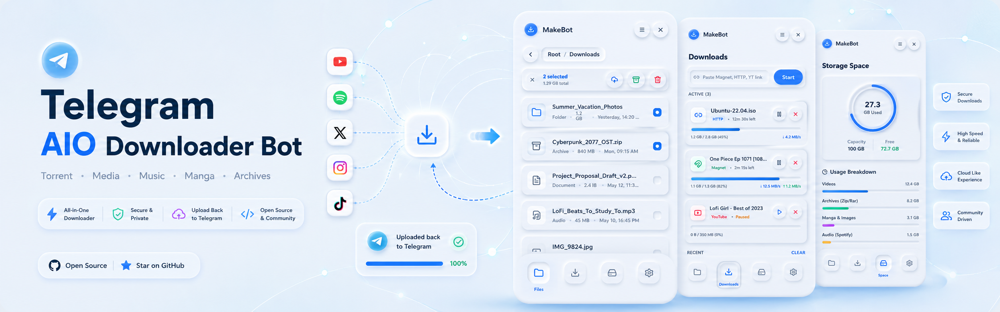

# Telegram AIO Downloader Bot

An asynchronous Telegram bot and Mini App for downloading, organizing, processing, and uploading media and files from a VPS.

> Use this project only for content you are authorized to access. It does not bypass DRM, paid access, private-content restrictions, or copyright law.

## Features

- Torrent and magnet downloads through `aria2c`
- Direct HTTP/HTTPS file downloads with resume support
- YouTube and social-media video or audio downloads through `yt-dlp`
- Spotify tracks, albums, playlists, artists, shows, and episodes through `spotDL`
- Manga and image-gallery downloads with optional PDF conversion
- ZIP and 7Z creation, password protection, and volume splitting
- Upload files and folders to Telegram Saved Messages through Pyrogram
- Sequential batch processing with download-only or upload-and-delete modes
- Live progress, speed, ETA, cancellation, storage, and file-management controls
- Telegram Mini App for downloads, files, storage, uploads, archives, and settings
- TPB, RARBG-style, and Prowlarr torrent search integrations

See [Supported Sites](docs/SUPPORTED_SITES.md) for the complete provider list and current limitations.

## Mainstream Media Support

| Platform | Video | Audio |
|---|---:|---:|
| YouTube | Yes | Yes |
| TikTok | Yes | Yes |
| Instagram | Yes | Yes |
| X / Twitter | Yes | Yes |
| Facebook | Yes | Yes |
| Vimeo, Dailymotion, and Twitch | Yes | Yes |
| Spotify | Music and podcasts | Yes |

## Common Inputs

| Input | Handler |
|---|---|
| Magnet or `.torrent` file | aria2 torrent downloader |
| Direct file URL | aria2 HTTP downloader |
| YouTube or supported social-media URL | yt-dlp video/audio downloader |
| Spotify URL | spotDL audio downloader |
| Manga or gallery URL | Gallery downloader |
| Supported playlist or profile URL | Sequential batch downloader |

## Quick Start

### Ubuntu

```bash
git clone https://github.com/cyanologyst/Telegram-Aio-Downloader.git
cd Telegram-Aio-Downloader
bash scripts/setup_ubuntu.sh
```

The setup script installs system tools, creates `.venv`, installs Python dependencies, writes `.env`, and optionally configures Prowlarr.

Start the bot:

```bash
source .venv/bin/activate
python main.py
```

For a Mini App without a permanent HTTPS domain:

```bash
bash scripts/start_with_cloudflare_tunnel.sh
```

### Manual Setup

```bash
python -m venv .venv
source .venv/bin/activate
pip install -r requirements.txt
cp .env.example .env
python main.py
```

On Windows, activate the environment with:

```powershell
.\.venv\Scripts\Activate.ps1
```

## Configuration

Required values in `.env`:

```dotenv
BOT_TOKEN=
API_ID=
API_HASH=
```

Common optional settings:

| Variable | Purpose |
|---|---|
| `ALLOWED_USER_IDS` | Comma-separated Telegram user IDs |
| `PYRO_SESSION_NAME` | Pyrogram session used for Telegram uploads |
| `YTDLP_COOKIES_FILE` | Netscape cookies file for supported authenticated pages |
| `YTDLP_PROXY` | Optional yt-dlp proxy |
| `DENO_BIN` | Absolute Deno path when required by a provider |
| `PROWLARR_URL` / `PROWLARR_API_KEY` | Prowlarr torrent search |
| `TPB_API_URL` / `RARBG_BASE_URL` | Torrent-search endpoints |
| `WEB_APP_URL` | Public HTTPS URL for the Telegram Mini App |
| `SUPPORTED_SITES_URL` | URL opened by the bot's Supported Sites button |

See [.env.example](.env.example) for all available settings.

## Updating

```bash
git pull
source .venv/bin/activate
pip install -U -r requirements.txt
python main.py
```

Restart your systemd, PM2, Docker, or other process manager after the dependency update.

## Development

```bash
pip install -r requirements/dev.txt
ruff check app tests
black --check app tests
isort --check-only app tests
mypy app
pytest
```

Project documentation:

- [Architecture](docs/architecture.md)
- [Development Guide](docs/development.md)
- [Extension Guide](docs/extension-guide.md)
- [Mini App Guide](docs/miniapp-guide.md)
- [Supported Sites](docs/SUPPORTED_SITES.md)
- [Contributing](CONTRIBUTING.md)

## License

See [LICENSE](LICENSE).
